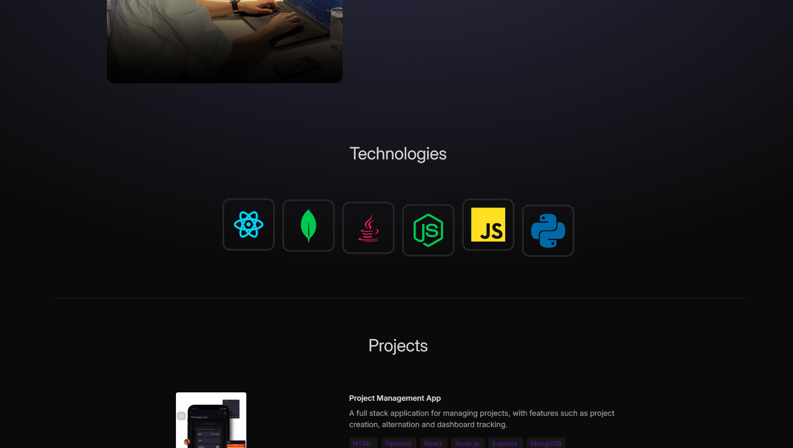

# 🌟 Portfolio Website

## 📝 Description

This is a personal portfolio website designed to showcase my projects, skills, and contact information. The goal of this project is to create a clean and responsive platform for potential employers and collaborators to learn more about me and my work.

---

## Table of Contents

- [📝 Description](#-description)
- [Table of Contents](#table-of-contents)
- [🚀 Features](#-features)
- [🛠️ Technologies Used](#️-technologies-used)
- [🖥️ Installation](#️-installation)
- [🎨 Usage](#-usage)
- [🔗 Live Demo](#-live-demo)
- [📬 Contact](#-contact)
- [📄 License](#-license)
- [🙏 Acknowledgments](#-acknowledgments)

---

## 🚀 Features

- **About Me Section**: A brief introduction about myself and my background.
- **Skills Section**: Displaying my technical skills and tools I work with.
- **Projects Showcase**: Highlighting my best projects with descriptions and links.
- **Contact Information**: Easy-to-find contact details for reaching out.
- **Animations**: Smooth animations powered by Framer Motion.
- **Responsive Design**: Optimized for both desktop and mobile devices.

---

## 🛠️ Technologies Used

- **Frontend**: React, Tailwind CSS
- **Styling**: Tailwind CSS
- **Animations**: Framer Motion
- **Deployment**: Nertlify

---

## 🖥️ Installation

To run this project locally, follow these steps:

1. Clone the repository:
   ```bash
   git clone https://github.com/PreZko/Portfolio-ReactJS.git
   ```
2. Navigate to the project directory
   ```bash
   cd Portfolio-ReactJS
   ```
3. Install dependencies:
   ```bash
   npm install
   ```
4. Start the development server:

   ```bash
   npm run dev
   ```

5. Open your browser and visit `http://localhost:3000` to view the website.

---

## 🎨 Usage

- The website is a single-page application with a smooth scrolling effect.
- Navigate through the sections (About Me, Projects, Technologies, Contact) by scrolling down.
- Click on project links to view their details or visit their live demos.
- Enjoy the smooth animations powered by Framer Motion!



## 🔗 Live Demo

Check out the live version of my portfolio:  
[Portfolio Website Live Demo](https://presiyan.netlify.app)

## 📬 Contact

If you'd like to connect or have any questions, feel free to reach out:

- **Email**: presiyan_bankov@gmail.com
- **LinkedIn**: [Presiyan Bankov](https://linkedin.com/in/presiyan-bankov)
- **GitHub**: [PreZko](https://github.com/prezko)

## 📄 License

This project is licensed under the MIT License. See the [LICENSE](LICENSE) file for details.

## 🙏 Acknowledgments

- Thanks to [Vite](https://vitejs.dev) for the fast and modern build tool.
- Thanks to [Tailwind CSS](https://tailwindcss.com) for the amazing utility-first CSS framework.
- Thanks to [Framer Motion](https://www.framer.com/motion/) for the smooth animations.
- Inspired by [compiletab](https://www.youtube.com/@compiletab/videos).
